  

  
  
  

I build systems that make their own decisions checkable — pipelines with a trace, agents with an
independent verifier, orchestration engines that show every step instead of hiding it behind one
black-box call. That discipline shows up across everything below: a generic agent-orchestration
engine, a RAG pipeline that measures its own hallucination rate, a distributed job scheduler you
can watch execute live, and a couple of financial-systems and applied-AI projects that apply the
same idea to messier, real-world data.

**Currently exploring:**
- Multi-agent pipelines where a *second, independent* pass checks the first agent's work, instead
  of trusting one model's output at face value
- Lightweight orchestration primitives (routing, retries, structured tracing) built as reusable
  infrastructure, not one-off app glue
- Applying that same "inspectable pipeline" discipline to financial-data systems and real-time
  distributed workloads

---

### Agent orchestration & pipelines

| Project | What it does |
|---|---|
| **[stagechain](https://github.com/divyaanshkumar24/stagechain)** | A generic engine for chaining and routing tasks between AI agents or plain callables — triage/routing, retries with backoff, and a structured execution trace. Zero required dependencies in the core engine. |
| **[Regulatory Filing Intelligence Agent](https://github.com/divyaanshkumar24/Regulatory-Filing-Intelligence-Agent)** | A 3-agent RAG pipeline over real SEC filings: retrieval → grounded answer → an *independent* Claude call that checks whether the answer is actually supported by its cited source text, and flags it if not. |
| **[Conductor](https://github.com/divyaanshkumar24/Dc-conductor)** | A distributed job scheduler — jobs get decomposed and bin-packed across a fleet of Docker worker nodes with a Best-Fit-Decreasing algorithm, with execution streamed back live over WebSockets. |
| **[Clearline](https://github.com/divyaanshkumar24/clearline-backend)** | A call-analysis pipeline: transcribe a recording (faster-whisper), identify speakers (pyannote.audio diarization), and generate insights from the conversation — three inspectable stages, not one opaque call. |

### Financial systems & applied AI

| Project | What it does |
|---|---|
| **[TradedataPipeline](https://github.com/divyaanshkumar24/TradedataPipeline)** | A synthetic securities lending/repo trade pipeline — FastAPI REST API, analytics layer, SQLAlchemy (SQLite/Postgres), Docker, CI. All data is synthetic; built to demonstrate the systems design, not real trading. |
| **[Social Pal](https://github.com/divyaanshkumar24/social-autopilot)** | An AI-driven relationship-intelligence dashboard — analyzes messaging patterns, scores relationship health, detects anomalies, and generates actionable recommendations. |

Also shipped: **[Cipher Studio](https://github.com/divyaanshkumar24/Cipher-Studio)** (visual tool for understanding encryption/decryption ciphers) and **[attendease](https://github.com/divyaanshkumar24/attendease)** (Next.js 14 + Supabase attendance calculator).

---

### Tech stack

  
  
  
  
  
  
  
  
  
  
  
  

### Activity

  

  <picture>
    <source media="(prefers-color-scheme: dark)" srcset="https://raw.githubusercontent.com/divyaanshkumar24/divyaanshkumar24/output/github-contribution-grid-snake-dark.svg">
    <source media="(prefers-color-scheme: light)" srcset="https://raw.githubusercontent.com/divyaanshkumar24/divyaanshkumar24/output/github-contribution-grid-snake.svg">
    
  </picture>
   
  <i>Generated by a GitHub Actions workflow in this repo (<code>.github/workflows/snake.yml</code>) — updates automatically every 12 hours.</i>

  Reach out on <a href="https://www.linkedin.com/in/divyaanshkumargupta/">LinkedIn</a>, by <a href="mailto:divyaanshkumargupta24@gmail.com">email</a>, or through <a href="https://divyaanshkumargupta.me">divyaanshkumargupta.me</a>.

